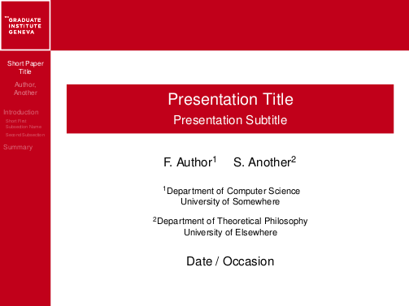
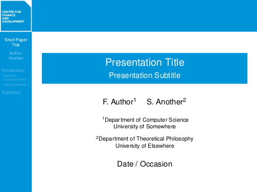

BeamerGeneva
======================================================
Bastiaan Quast <bquast@gmail.com>
------------------------------------------------------

Introduction
------------------------------------------------------
This is a `colortheme` for the `LaTeX` documentclass `beamer`. The colortheme is intended for The Graduate Institute, Geneva, and for The Centre for Finance and Development. 

The Graduate Institute theme looks like this:

The Centre for Finance and Development Theme looks like this:

Installation
------------------------------------------------------
The package consists of three files:

 1. beamercolorthemegeneva.sty
 2. GI.png
 3. CFD.png

The `beamcolorthemgeneva.sty` file contains the instructions for colortheming. The `GI.png` file is the logo for the Graduate Institute theme. The `CFD.png` file is the logo the CFD theme.

To use the theme only once, simply place the files in the folder of your tex file.

In order to install the package properly, copy the files to the `colortheme` folder of your `TeX` distribution. This folder can usually be found in:

    texmf/tex/latex/beamer/base/themes

After this, open the `terminal` / `command prompt` and run `texhash`.

Usage
------------------------------------------------------
This is a beamer `colortheme`, which means that it is a modification of a general beamer `theme`. It is intended to be used with the `Berkeley` theme, but can also be used with others. To use the Graduate Institute theme, add the following code to your preamble:

    \usetheme{Berkeley}
    \usecolortheme{geneva}

If you would like to use the CFD theme, we simply pass the cfd option to the colortheme, as follows:

    \usetheme{Berkeley}
    \usecolortheme[cfd]{geneva}

That's it!

Notice
------------------------------------------------------
This package is provided *as is*, *without* any warranty. The logos and theme are owner by their respective owners. This package is intended to simplify the use of these *if you are entitled to use them*. The author of this package is *not* the owner of theese logos and themes, and as such, cannot provide you with permission to use them.